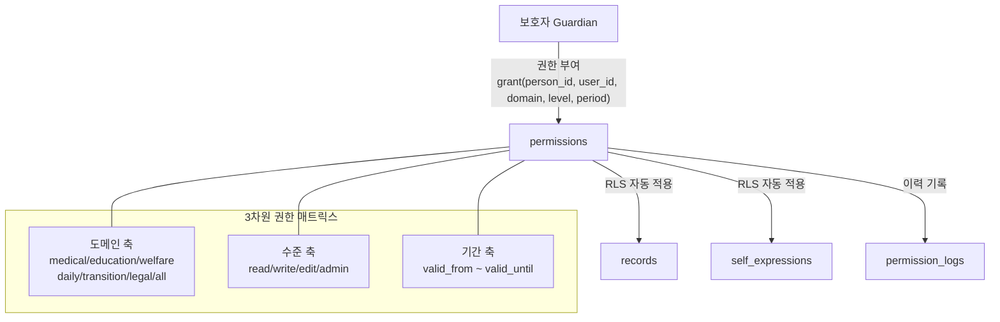
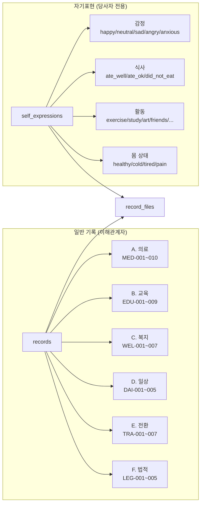
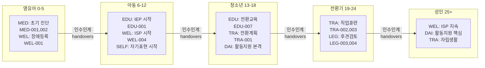

# ERD — OnDol 플랫폼

> 도구: Mermaid erDiagram | 버전: v1.1 (docs/02 v1.1 기준)
>
> **v1.1 변경(docs/02 v1.1 데이터모델 정합):** ①엔티티 2종 추가 — `secure_identifiers`(고유식별정보 암호화 분리, docs/02 §2.14)·`consents`(동의 이력, docs/02 §2.15) ②사용자 대면 8개 테이블에 `deleted_at` soft-delete 컬럼 추가(docs/02 §1 정책, docs/16 §4.3) ③`guardian_persons`·`self_expressions` 부분 유니크(`WHERE deleted_at IS NULL`) 반영 ④신규 enum 2종(`secure_identifier_type`·`consent_type`) 컬럼 주석 인라인. append-only 로그(`access_logs`·`permission_logs`)는 `deleted_at` 제외.

---

## 전체 ERD

```mermaid
erDiagram

  %% ============================================================
  %% 핵심 엔티티
  %% ============================================================

  persons {
    uuid    id                  PK
    text    name                "이름"
    date    birth_date          "생년월일"
    text    gender              "성별"
    text[]  disability_types    "장애 유형 목록"
    text    disability_grade    "장애 정도"
    text    photo_url
    jsonb   emergency_info      "응급 정보(핀고정)"
    text    current_life_stage  "현재 생애주기"
    timestamptz created_at
    timestamptz updated_at
    timestamptz deleted_at      "soft-delete (NULL=활성)"
  }

  users {
    uuid    id                  PK "= auth.users.id"
    text    name                "이름"
    text    role                "guardian|person|supporter|teacher|social_worker|therapist"
    text    phone
    text    organization        "소속 기관"
    text    organization_type
    text    profile_photo_url
    boolean is_active
    timestamptz created_at
  }

  %% ============================================================
  %% 연결 테이블
  %% ============================================================

  guardian_persons {
    uuid    id                  PK
    uuid    guardian_id         FK
    uuid    person_id           FK
    boolean is_primary          "주보호자 여부"
    text    relationship        "부|모|형제|후견인 등"
    timestamptz created_at
    timestamptz deleted_at      "soft-delete; 부분 유니크 WHERE deleted_at IS NULL"
  }

  person_accounts {
    uuid    person_id           PK "FK"
    uuid    user_id             FK "NULL 가능"
    jsonb   accessibility_settings
    text    ui_mode             "icon|mixed"
    timestamptz created_at
    timestamptz deleted_at      "soft-delete (NULL=활성)"
  }

  %% ============================================================
  %% 권한 관리
  %% ============================================================

  permissions {
    uuid    id                  PK
    uuid    person_id           FK
    uuid    user_id             FK
    uuid    granted_by          FK
    text    domain              "medical|education|welfare|daily|transition|legal|all"
    text    access_level        "read|write|edit|admin"
    date    valid_from
    date    valid_until         "NULL=무기한"
    text    note                "권한 부여 사유"
    boolean is_active
    timestamptz created_at
    timestamptz updated_at
  }

  permission_logs {
    uuid    id                  PK
    uuid    permission_id       FK "삭제 후 NULL 가능"
    uuid    person_id           FK
    uuid    user_id
    text    action              "granted|revoked|modified|expired"
    uuid    changed_by          FK
    text    domain
    jsonb   old_value
    jsonb   new_value
    timestamptz created_at
  }

  %% ============================================================
  %% 기록
  %% ============================================================

  records {
    uuid    id                  PK
    uuid    person_id           FK
    uuid    author_id           FK
    text    domain              "medical|education|welfare|daily|transition|legal"
    text    record_type         "MED-001 ~ LEG-005"
    text    title
    jsonb   content             "기록 유형별 구조화 데이터"
    text    summary             "당사자용 짧은 요약"
    text    life_stage          "infant|child|adolescent|young_adult|adult|senior"
    date    record_date         "기록 대상 날짜"
    boolean is_milestone
    boolean is_pinned
    boolean is_draft
    text[]  tags
    timestamptz created_at
    timestamptz updated_at
    timestamptz deleted_at      "soft-delete (NULL=활성)"
  }

  self_expressions {
    uuid    id                  PK
    uuid    person_id           FK
    date    expression_date     "UNIQUE per person"
    text    emotion             "happy|neutral|sad|angry|anxious"
    text    meal_status         "ate_well|ate_ok|ate_poorly|did_not_eat"
    text    meal_photo_url
    text[]  activities          "exercise|study|art|friends|..."
    text    body_condition      "healthy|cold|tired|pain|other"
    text    memo                "선택 메모"
    text    voice_memo_url
    timestamptz created_at
    timestamptz deleted_at      "soft-delete; 부분 유니크 WHERE deleted_at IS NULL"
  }

  record_files {
    uuid    id                  PK
    uuid    record_id           FK "NULL 가능"
    uuid    self_expression_id  FK "NULL 가능"
    uuid    uploader_id         FK
    text    file_name
    text    storage_path        "Supabase Storage 경로"
    text    file_type           "pdf|image|audio|document"
    bigint  file_size
    boolean is_sensitive        "진단서 등 민감 문서"
    timestamptz created_at
    timestamptz deleted_at      "soft-delete; Storage hard delete는 유예 후 배치"
  }

  %% ============================================================
  %% 개인정보 보호 (PIPA — docs/02 v1.1)
  %% ============================================================

  secure_identifiers {
    uuid    id                  PK "content/persons가 참조"
    uuid    person_id           FK "소유 당사자"
    uuid    record_id           FK "출처 기록, NULL 가능"
    text    identifier_type     "Enum SecureIdentifierType: disability_registration_number|disability_certificate_number"
    bytea   encrypted_value     "암호화된 원문(평문 저장 금지)"
    text    value_masked        "표시용 마스킹 값 123-45-****"
    text    encryption_ref      "Vault 시크릿/키 버전 식별자"
    uuid    created_by          FK "입력자(users)"
    timestamptz created_at
    timestamptz updated_at
    timestamptz deleted_at      "soft-delete (NULL=활성)"
  }

  consents {
    uuid    id                  PK
    uuid    subject_user_id     FK "성인 본인 동의(users), XOR person_id"
    uuid    person_id           FK "당사자 정보 동의, XOR subject_user_id"
    text    consent_type        "Enum ConsentType: terms_of_service|privacy_required|sensitive_info|unique_identifier|third_party_processing|marketing"
    boolean is_required         "필수(true)/선택(false) — 일괄동의 금지"
    boolean granted             "동의(true)/철회·거부(false)"
    uuid    consented_by        FK "실제 동의 주체(본인/법정대리인, users)"
    boolean on_behalf           "대리동의 여부"
    text    legal_basis         "대리동의 근거 친권자|성년후견인"
    text    policy_version      "동의 시점 약관/처리방침 버전"
    timestamptz consented_at
    timestamptz revoked_at      "철회 시각 (NULL=유효)"
    timestamptz deleted_at      "soft-delete (NULL=활성)"
  }

  %% ============================================================
  %% 생애 관리
  %% ============================================================

  life_milestones {
    uuid    id                  PK
    uuid    person_id           FK
    text    title
    text    description
    date    milestone_date
    text    category            "diagnosis|school_entry|graduation|..."
    text    life_stage
    uuid    created_by          FK
    timestamptz created_at
  }

  handovers {
    uuid    id                  PK
    uuid    person_id           FK
    uuid    from_user_id        FK "NULL=최초"
    uuid    to_user_id          FK
    text    domain
    date    period_start
    date    period_end
    text    summary
    text[]  key_notes
    uuid[]  priority_records    "중요 기록 ID 목록"
    boolean is_confirmed
    timestamptz confirmed_at
    timestamptz created_at
  }

  %% ============================================================
  %% 시스템
  %% ============================================================

  access_logs {
    uuid    id                  PK
    uuid    user_id             FK
    uuid    person_id           FK
    uuid    record_id           FK "NULL 가능"
    uuid    self_expression_id  FK "NULL 가능"
    text    action              "view|create|edit|delete|download|share|permission_change"
    inet    ip_address
    text    user_agent
    timestamptz created_at     "INSERT 전용, 수정불가"
  }

  notifications {
    uuid    id                  PK
    uuid    recipient_id        FK
    uuid    person_id           FK
    uuid    record_id           FK "NULL 가능"
    uuid    self_expression_id  FK "NULL 가능"
    text    type                "new_record|permission_granted|permission_revoked|handover|milestone"
    text    title
    text    body
    boolean is_read
    timestamptz created_at
  }

  %% ============================================================
  %% 관계 정의
  %% ============================================================

  persons         ||--o{ guardian_persons    : "has"
  users           ||--o{ guardian_persons    : "is guardian of"

  persons         ||--o| person_accounts     : "has account"
  users           ||--o| person_accounts     : "account of"

  persons         ||--o{ permissions         : "has"
  users           ||--o{ permissions         : "granted to"
  users           ||--o{ permissions         : "granted by (granted_by)"
  permissions     ||--o{ permission_logs     : "has history"

  persons         ||--o{ records             : "has"
  users           ||--o{ records             : "authored by"

  persons         ||--o{ self_expressions    : "expressed by"

  records         ||--o{ record_files        : "has files"
  self_expressions||--o{ record_files        : "has files"

  persons         ||--o{ secure_identifiers  : "owns"
  records         ||--o{ secure_identifiers  : "source of"
  users           ||--o{ secure_identifiers  : "created by (created_by)"

  users           ||--o{ consents            : "consents (subject/consented_by)"
  persons         ||--o{ consents            : "subject of"

  persons         ||--o{ life_milestones     : "has"
  users           ||--o{ life_milestones     : "created by"

  persons         ||--o{ handovers           : "has"
  users           ||--o{ handovers           : "from user"
  users           ||--o{ handovers           : "to user"

  users           ||--o{ access_logs         : "generated by"
  persons         ||--o{ access_logs         : "about"

  users           ||--o{ notifications       : "received by"
  persons         ||--o{ notifications       : "about"
  records         ||--o{ notifications       : "linked to (optional)"
  self_expressions||--o{ notifications       : "linked to (optional)"
```



---

## 도메인별 서브 ERD

### 권한 흐름 (Permission Flow)



### 기록 계층 (Record Hierarchy)



### 생애주기 흐름 (Lifecycle Flow)



---

## 테이블 간 참조 정리

| 테이블 | 참조하는 테이블 | 참조 키 | 설명 |
|--------|--------------|--------|------|
| `guardian_persons` | `users`, `persons` | guardian_id, person_id | 보호자-당사자 연결 |
| `person_accounts` | `persons`, `users` | person_id, user_id | 당사자 계정 연결 |
| `permissions` | `persons`, `users`(×2) | person_id, user_id, granted_by | 권한 매트릭스 |
| `permission_logs` | `permissions`, `persons`, `users` | permission_id, person_id, changed_by | 권한 변경 이력 (user_id는 권한 대상자 ID로 저장, 형식 FK 아님) |
| `records` | `persons`, `users` | person_id, author_id | 기록 |
| `self_expressions` | `persons` | person_id | 당사자 자기표현 |
| `record_files` | `records` OR `self_expressions`, `users` | record_id XOR self_expression_id | 첨부 파일 |
| `secure_identifiers` | `persons`, `records`(선택), `users` | person_id, record_id, created_by | 고유식별정보 암호화 분리 저장 (docs/02 §2.14, PIPA §24) |
| `consents` | `users`(×2), `persons` | subject_user_id, consented_by, person_id (subject_user_id XOR person_id) | 동의 이력 (docs/02 §2.15, PIPA §22~24) |
| `access_logs` | `users`, `persons`, `records`(선택), `self_expressions`(선택) | | 접근 로그 |
| `life_milestones` | `persons`, `users` | person_id, created_by | 이정표 |
| `handovers` | `persons`, `users`(×2) | person_id, from_user_id, to_user_id | 인수인계 |
| `notifications` | `users`, `persons`, `records`(선택), `self_expressions`(선택) | recipient_id, person_id, record_id, self_expression_id | 알림 |

---

## RLS 정책 요약 (DB 레벨 보안)

```
records 열람 허용 조건:
  1. guardian_persons에 해당 보호자로 등록되어 있음 (전체 접근)
  2. person_accounts에 당사자 본인으로 등록되어 있음 (전체 열람)
  3. permissions에 해당 분야(domain) + 유효 기간 + read 이상 권한 존재

self_expressions 작성 허용 조건:
  - person_accounts에 본인 계정으로 등록되어 있음 (당사자만)

access_logs:
  - INSERT만 허용 (UPDATE, DELETE 정책 없음 → 자동 거부)
```
