# 사용자별 워크플로우 — OnDol 플랫폼

> Mermaid flowchart 형식 | VS Code Mermaid 확장 또는 https://mermaid.live 에서 렌더링

---

## 목차
1. [보호자 (Guardian)](#1-보호자)
2. [당사자 (Person)](#2-당사자)
3. [활동지원사 (Supporter)](#3-활동지원사)
4. [특수교사 (Teacher)](#4-특수교사)
5. [사회복지사 (Social Worker)](#5-사회복지사)
6. [치료사 (Therapist)](#6-치료사)
7. [역할별 진입점 비교](#7-역할별-진입점-비교)

---

## 1. 보호자

보호자는 플랫폼의 최고 관리자다. 당사자를 등록하고, 모든 기록에 접근하며, 다른 이해관계자에게 권한을 부여한다.

### 1-1. 보호자 최초 온보딩

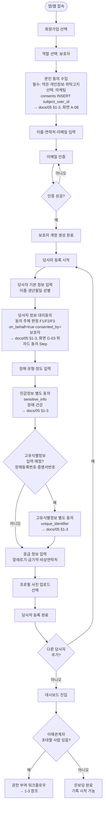

### 1-2. 보호자 일상 사용 흐름

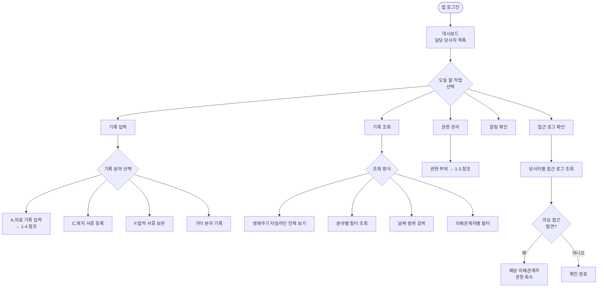

### 1-3. 이해관계자 권한 부여/회수

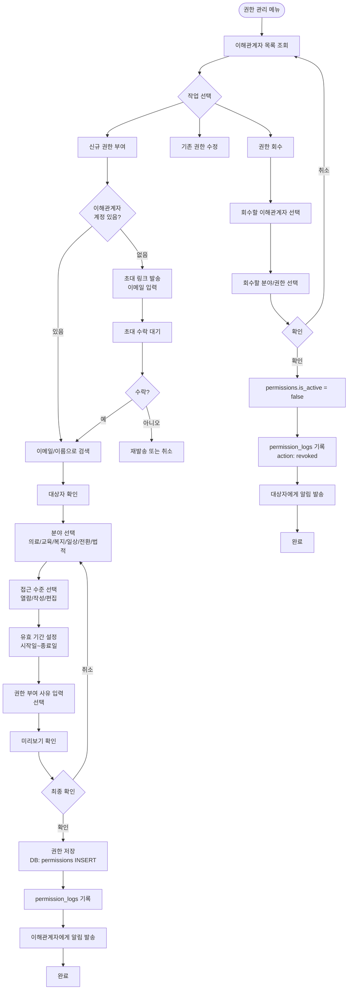

### 1-4. 의료 기록 입력 (보호자 전용)

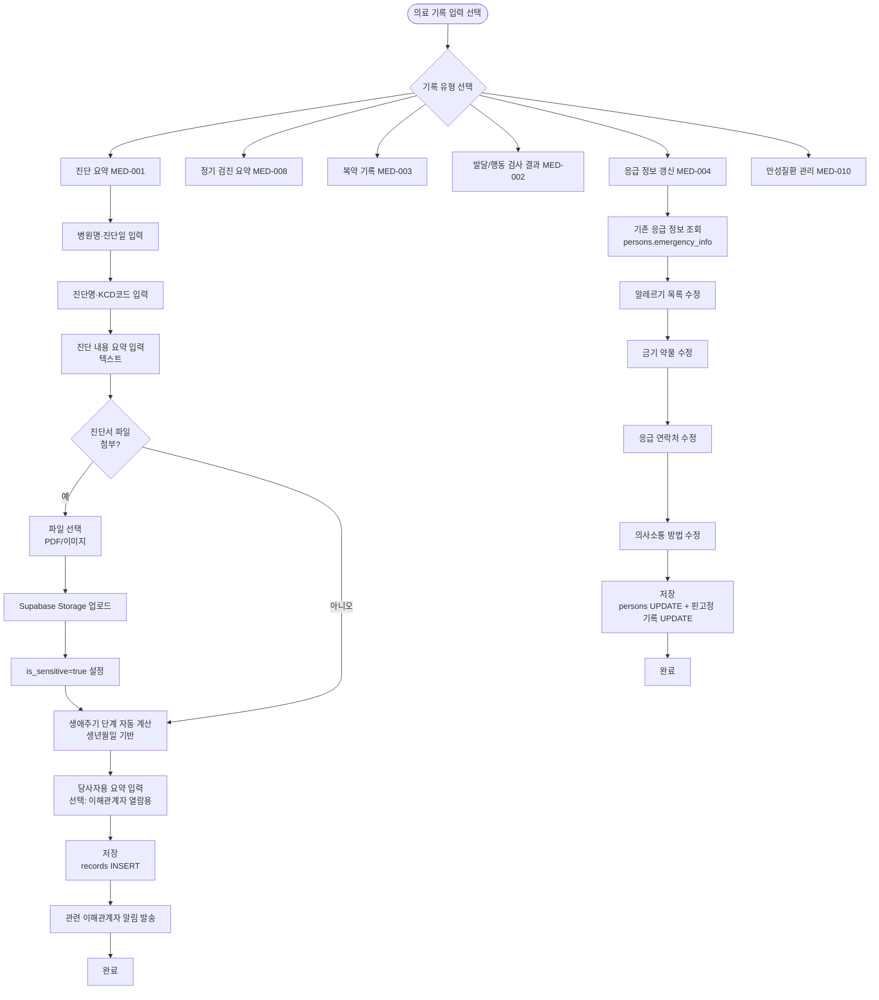

---

## 2. 당사자

당사자는 이미지 선택 방식의 전용 UI를 통해 자기표현을 기록하고, 다른 이해관계자의 기록을 열람한다.

### 2-1. 당사자 계정 최초 접속

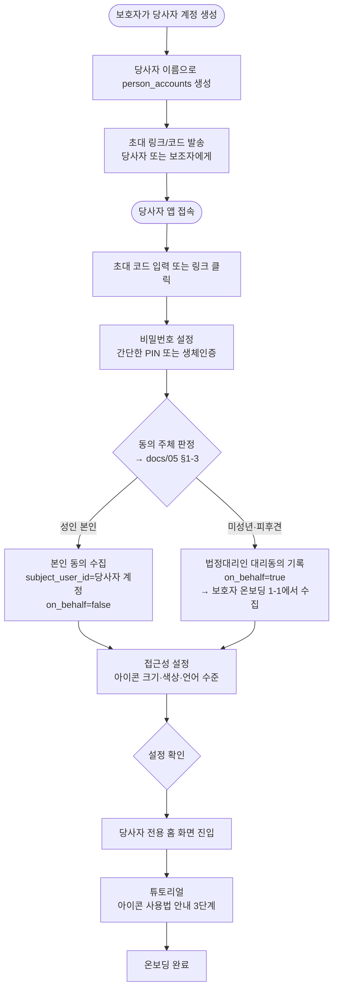

### 2-2. 오늘 자기표현 기록 (핵심 플로우)

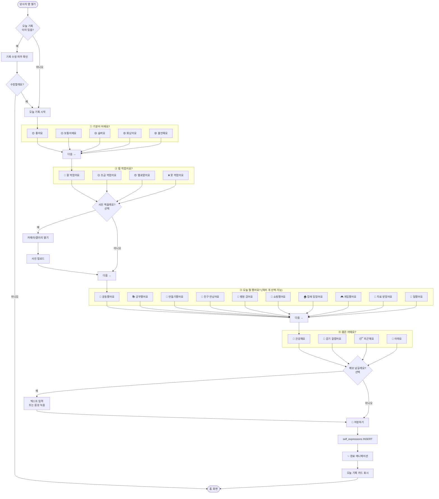

### 2-3. 기록 열람 (당사자 뷰)

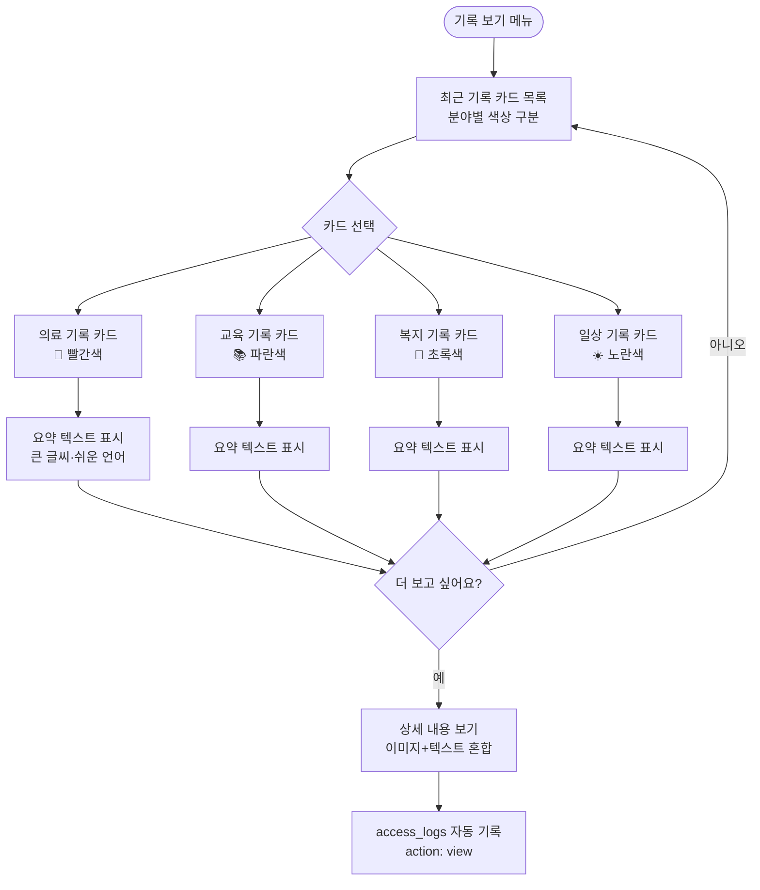

---

## 3. 활동지원사

활동지원사는 서비스 제공일마다 모바일로 활동지원 일지를 작성한다. 담당 기간과 일상 분야 기록에만 접근한다.

### 3-1. 활동지원사 온보딩

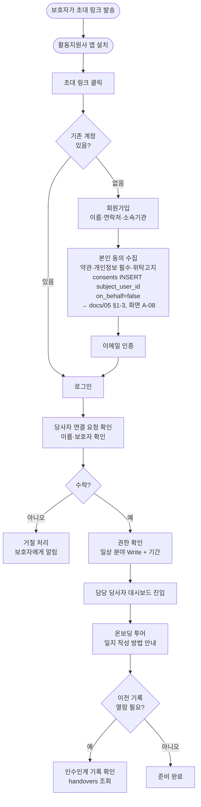

### 3-2. 활동지원 일지 작성 (DAI-002)

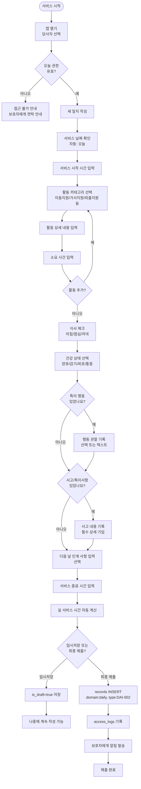

### 3-3. 이전 기록 및 인수인계 확인

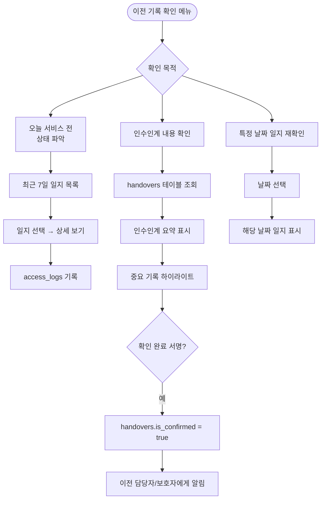

---

## 4. 특수교사

특수교사는 교육 분야 기록을 작성한다. IEP는 연 1회 공식 문서이며, 학교생활 관찰은 정기적으로 작성한다.

### 4-1. 특수교사 온보딩

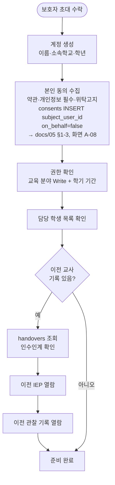

### 4-2. IEP 작성 (EDU-001)

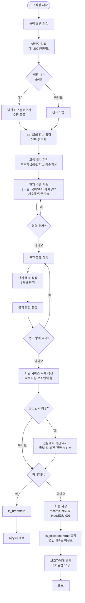

### 4-3. IEP 중간 점검 (EDU-003)

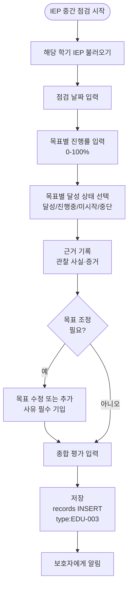

### 4-4. 학교생활 관찰 기록 (EDU-004)

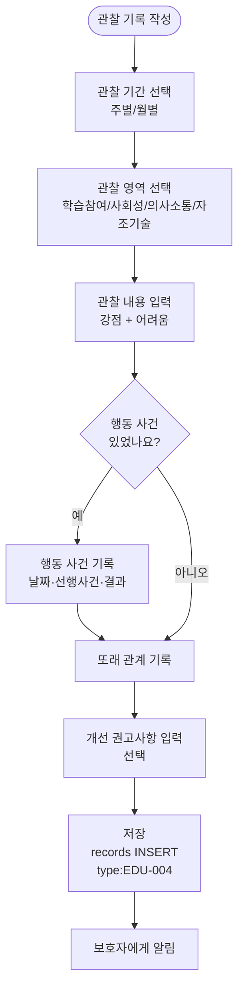

---

## 5. 사회복지사

사회복지사는 복지서비스와 전환 분야를 담당한다. ISP를 통해 당사자의 삶 전반을 계획하고 점검한다.

### 5-1. 사회복지사 온보딩

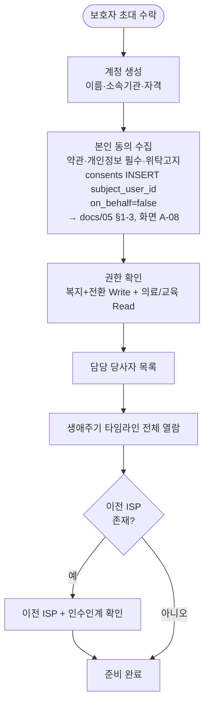

### 5-2. ISP (개인지원계획) 수립 (WEL-004)

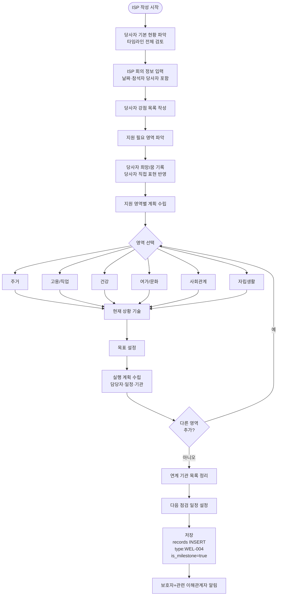

### 5-3. 전환계획 작성 (TRA-001)

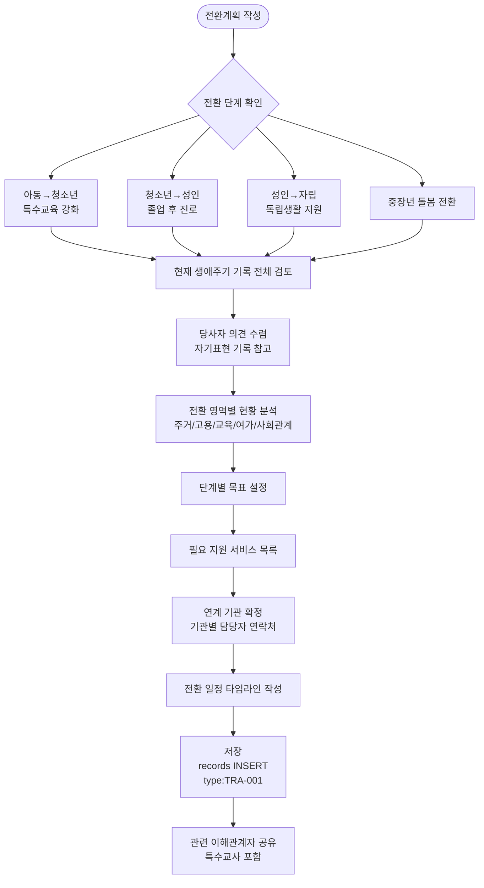

---

## 6. 치료사

치료사는 의료 분야 중 치료 파트를 담당한다. 치료 계획서를 수립하고 매 회기 일지를 기록한다.

### 6-1. 치료사 온보딩

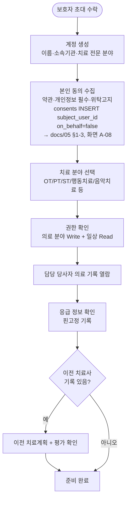

### 6-2. 치료 계획서 작성 (MED-005)

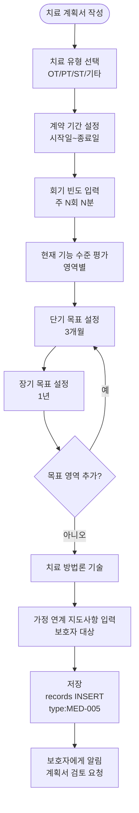

### 6-3. 치료 회기 일지 작성 (MED-006)

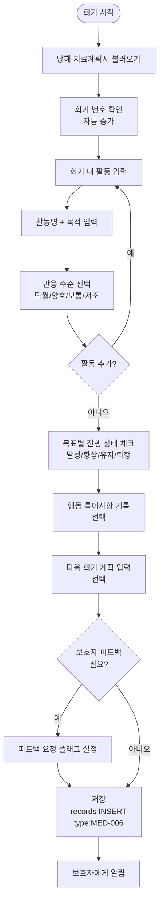

---

## 7. 역할별 진입점 비교

```mermaid
flowchart LR
    subgraph 보호자["보호자 (Guardian)"]
        G1[대시보드\n전체 당사자 목록]
        G2[타임라인 전체 조회]
        G3[기록 입력 전 분야]
        G4[권한 관리]
    end

    subgraph 당사자["당사자 (Person)"]
        P1[오늘 기록하기\n이미지 선택]
        P2[기록 보기\n요약 카드]
    end

    subgraph 활동지원사["활동지원사 (Supporter)"]
        S1[일지 작성\n모바일 최적화]
        S2[이전 일지 확인]
        S3[인수인계 확인]
    end

    subgraph 특수교사["특수교사 (Teacher)"]
        T1[IEP 작성/점검]
        T2[관찰 기록 작성]
        T3[교육 기록 목록]
    end

    subgraph 사회복지사["사회복지사 (Social Worker)"]
        W1[ISP 수립/점검]
        W2[전환계획 작성]
        W3[전체 기록 조회\n권한 범위 내]
    end

    subgraph 치료사["치료사 (Therapist)"]
        TH1[치료계획서 작성]
        TH2[회기 일지 작성]
        TH3[평가 보고서 작성]
    end

    LOGIN([로그인]) --> 보호자
    LOGIN --> 당사자
    LOGIN --> 활동지원사
    LOGIN --> 특수교사
    LOGIN --> 사회복지사
    LOGIN --> 치료사
```
