# 기능별 워크플로우 — OnDol 플랫폼

> Mermaid flowchart 형식
>
> **개정(2026-06-14, docs/16 거버넌스 정합):** §1에 동의 수집 단계(1-3) 추가 — 필수/선택·민감정보·고유식별정보 별도 동의, 14세 미만·피후견인 대리동의(docs/16 TBD #7 해소). §10 성인전환기에 본인 동의 재취득 흐름 추가(docs/16 TBD #6 해소). `consents`·`secure_identifiers` 테이블은 docs/02 §2.14·§2.15 참조.

---

## 목차
1. [회원가입 & 역할별 온보딩](#1-회원가입--역할별-온보딩)
2. [권한 부여 프로세스](#2-권한-부여-프로세스)
3. [권한 회수 프로세스](#3-권한-회수-프로세스)
4. [기록 작성 공통 프로세스 (RLS 포함)](#4-기록-작성-공통-프로세스)
5. [파일 첨부 프로세스](#5-파일-첨부-프로세스)
6. [생애주기 타임라인 조회](#6-생애주기-타임라인-조회)
7. [인수인계 프로세스](#7-인수인계-프로세스)
8. [알림 발송/수신 프로세스](#8-알림-발송수신-프로세스)
9. [접근 로그 조회](#9-접근-로그-조회)
10. [당사자 전환기 처리 (생애주기 변경)](#10-당사자-전환기-처리)
11. [시스템 보안 흐름 (Sequence)](#11-시스템-보안-흐름)
12. [전체 플랫폼 상태 흐름도](#12-전체-플랫폼-상태-흐름도)

---

## 1. 회원가입 & 역할별 온보딩

### 1-1. 전체 가입 분기

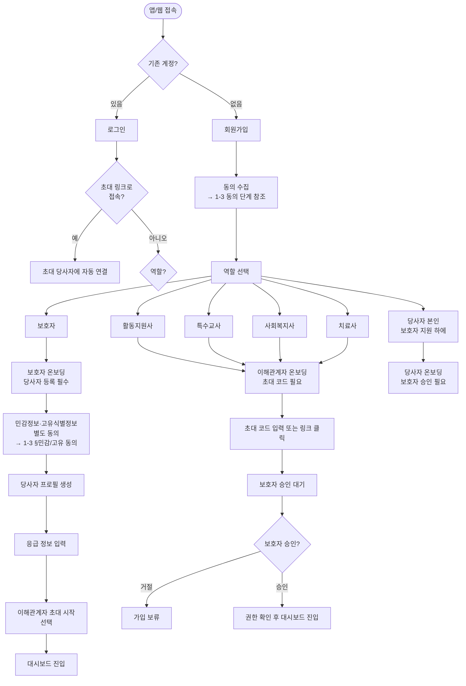

### 1-2. 초대 → 가입 → 연결 상세 흐름

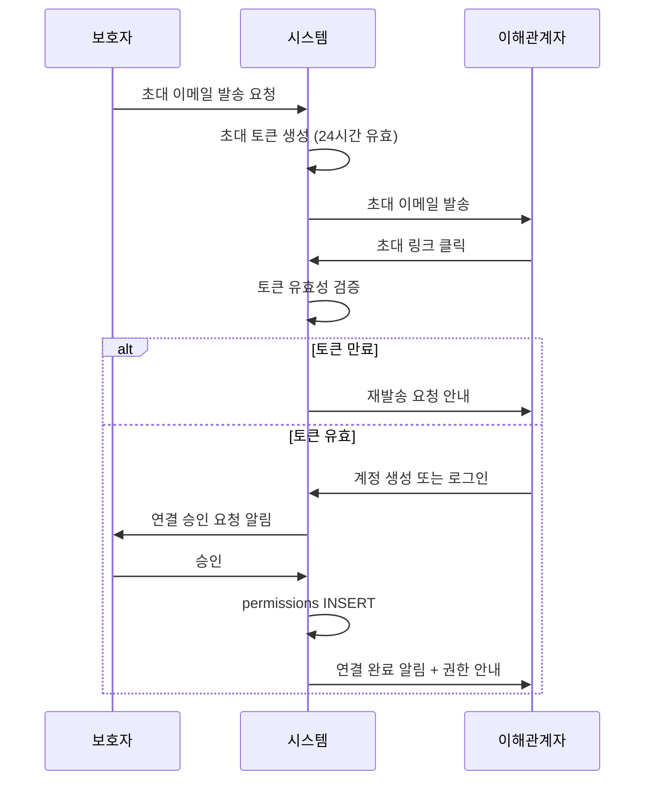

### 1-3. 동의 수집 단계 (PIPA §22~24 / docs/16 §2·§3)

회원가입(1-1 `CN` 노드) 및 당사자 등록(1-1 `CS` 노드)에서 거치는 동의 수집 흐름. 각 동의는 **분리된 체크박스**로 받으며 필수·선택을 묶어 일괄 동의받지 않는다(PIPA §22⑤). 동의 결과는 `consents` 테이블(docs/02 §2.15)에 유형별 분리 레코드로 INSERT된다.

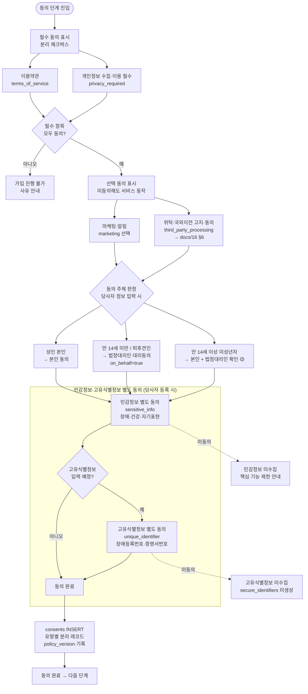

- **대리동의(docs/16 §2.2):** 만 14세 미만·피후견인은 `consents.on_behalf=true`, `consented_by`=법정대리인, `legal_basis`(친권자/성년후견인) 기록. 법정대리인 자격 증빙 절차는 미설계 🟡 (docs/16 TBD #8).
- 🟡 **F3(만 14세 이상 미성년자) 분기 권고(확정 필요, docs/16 §2.2.1):** 본인 동의(`subject_user_id`, `on_behalf=false`)만으로 당사자 등록·민감정보 저장을 **완료하지 않고 보류**(상태 `awaiting_guardian_confirmation`)한다. 법정대리인이 별도 인증 채널에서 확인하면 보조 레코드(`on_behalf=true`, `legal_basis='친권자'`)를 INSERT하고 두 레코드가 모두 존재할 때 상태 `confirmed`로 전이해 민감정보 저장을 활성화한다. **만 14세 이상 미성년자 민감정보의 본인 단독 동의 가부는 법무 확정** — 본인 의사 우선 원칙(TRA-006)과 미성년 계약 안정성을 절충한 권고다. 🔒 법정대리인 확인 링크는 만료·본인확인을 결합해 제3자 승인을 차단한다(권한 우회 위험).
- 🟡 **법정대리인 자격 증빙 권고(확정 필요, docs/16 §2.2.2):** 친권자=가족관계증명서, 성년후견인=후견등기사항증명서를 당사자 등록·후견 등록 시점에 검증한다. 증빙 서류는 그 자체가 민감·고유식별정보를 포함하므로 `record_files`(`is_sensitive=true`) 또는 전용 검증 스토리지에 저장하고 **검증 완료 후 결과 플래그만 유지·원본은 최소 보유기간 후 파기**한다. `consents.legal_basis`에는 검증 결과만 남긴다. **요구 증빙 수단·법정 확인 수준은 법무 확정.** 🔒 증빙 원본 장기보관은 단일 유출로 가족 PII 노출을 초래하므로 검증 후 즉시 파기/암호화 격리(증빙서류 PII 위험).
- **고유식별정보 동의(docs/16 §3.2):** `unique_identifier` 동의 없이는 `secure_identifiers`(docs/02 §2.14)에 등록번호·문서번호를 저장하지 않는다.
- **정책 버전:** 동의 시점 처리방침/약관 버전(`policy_version`)을 함께 저장해 변경 고지(docs/16 §7) 시 재동의 대상을 판별한다.

---

## 2. 권한 부여 프로세스

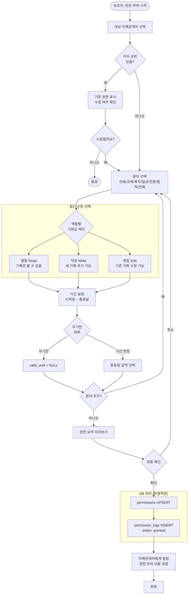

---

## 3. 권한 회수 프로세스

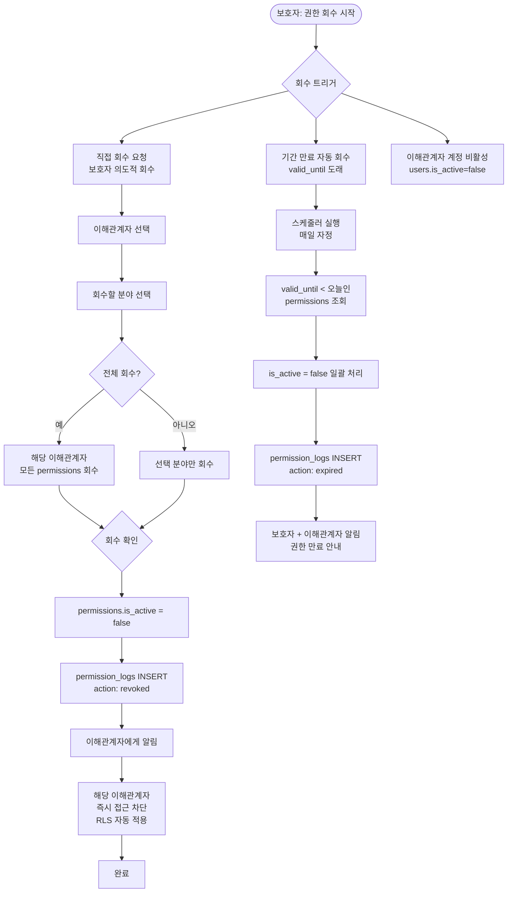

---

## 4. 기록 작성 공통 프로세스

모든 기록 작성 시 동일하게 거치는 RLS 검증 및 저장 흐름.

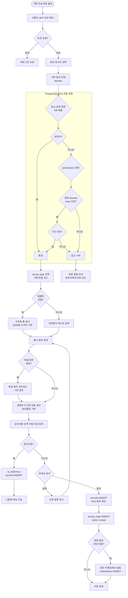

---

## 5. 파일 첨부 프로세스

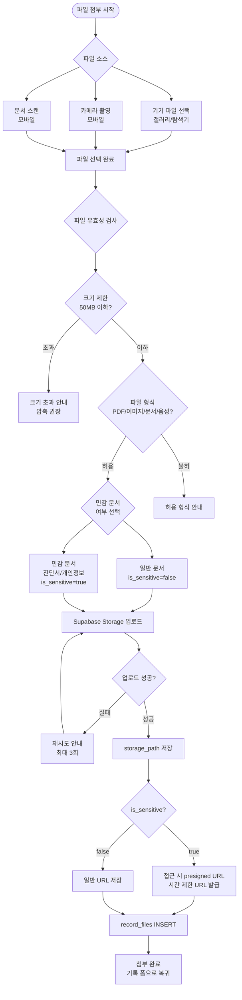

---

## 6. 생애주기 타임라인 조회

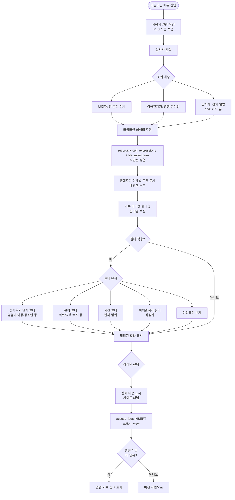

---

## 7. 인수인계 프로세스

### 7-1. 인수인계 생성 (담당자 교체 시)

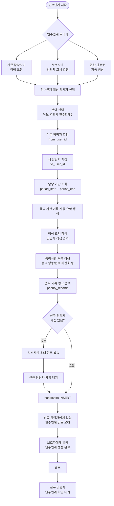

### 7-2. 신규 담당자 인수인계 수신

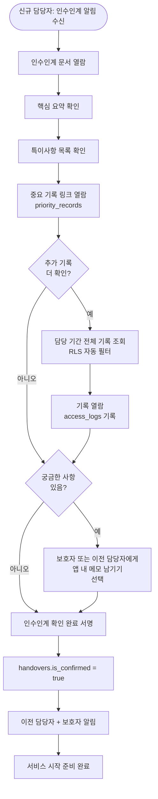

---

## 8. 알림 발송/수신 프로세스

### 8-1. 알림 발송 트리거 매트릭스

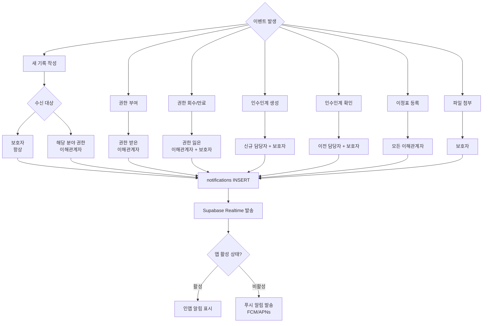

### 8-2. 알림 수신 및 처리

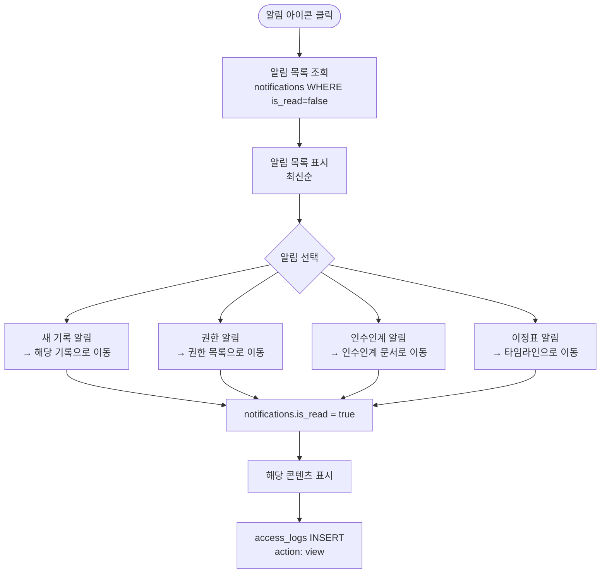

---

## 9. 접근 로그 조회

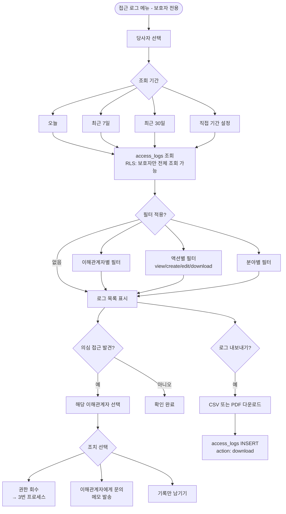

---

## 10. 당사자 전환기 처리

생애주기 단계가 변경될 때 (예: 아동→청소년, 청소년→성인전환기) 수행하는 프로세스.

```mermaid
flowchart TD
    A{전환기 트리거} --> B1[나이 기반 자동 감지\n시스템 스케줄러]
    A --> B2[보호자가 수동 변경]

    B1 --> C[보호자에게 알림\n생애주기 전환 시기 도래]
    B2 --> C

    C --> D[생애 이정표 등록\nlife_milestones INSERT\ncategory: 전환기]
    D --> E{전환 유형 확인}

    E --> F1[아동→청소년 (13세)]
    E --> F2[청소년→성인전환기 (19세)]
    E --> F3[성인전환기→성인 (25세)]
    E --> F4[성인→중장년 (40세)]

    %% 청소년 전환
    F1 --> G1[특수교사에게 알림\n전환교육 계획 수립 권고]
    G1 --> H1[사회복지사에게 알림\n전환계획 준비 권고]
    H1 --> I1

    %% 성인전환기
    F2 --> G2[특수교사 역할 만료 예고\n보호자에게 안내]
    G2 --> H2[사회복지사에게 알림\n성인 ISP 전환 준비]
    H2 --> I2[법적 서류 검토 알림\n후견/의사결정지원 계약]
    I2 --> RC{후견 개시 여부\nLEG-003 status}
    RC -- 성년후견 개시\nactive --> RC1[성년후견인이\n동의 주체 유지\nconsents on_behalf=true 유지]
    RC -- 후견 미개시\nnot_applicable --> RC2[본인 동의 재취득 절차 개시\n→ 1-3 동의 단계 재실행]
    RC1 --> I1
    RC2 --> RC3[본인 명의 신규 consents INSERT\nsubject_user_id=당사자 계정\non_behalf=false]
    RC3 --> RC4{기존 보호자 권한\n처리}
    RC4 --> RC5[본인이 권한 유지/회수 결정\n→ 2·3번 프로세스]
    RC5 --> I1

    F3 --> I1
    F4 --> I1

    I1[persons.current_life_stage 업데이트] --> J[타임라인에 전환기 마커 표시]
    J --> K{기존 담당자\n권한 연장 필요?}
    K -- 예 --> L[보호자 권한 갱신 요청]
    L --> M[권한 부여 프로세스\n→ 2번 참조]
    K -- 아니오 --> N[전환기 처리 완료]
    M --> N
```

> **성년 도달 동의 재취득 (docs/16 §2.3 / TBD #6 해소):** 당사자가 성년에 도달하면 법정대리인 대리동의의 법적 근거가 변동된다. 후견 미개시 시(`LEG-003.status='not_applicable'`) **본인 동의를 재취득**한다 — `person_accounts.user_id`로 당사자 계정을 연결하고, 1-3 동의 단계를 본인 명의로 재실행해 `consents`(docs/02 §2.15)에 `on_behalf=false` 신규 레코드를 INSERT한다. 기존 대리동의 레코드(`on_behalf=true`)는 이력으로 보존한다. 본인 동의 전환 후 기존 보호자 권한(`permissions`)의 유지/회수는 **당사자 본인이 결정**한다.

---

## 11. 시스템 보안 흐름

### 11-1. API 요청 보안 흐름

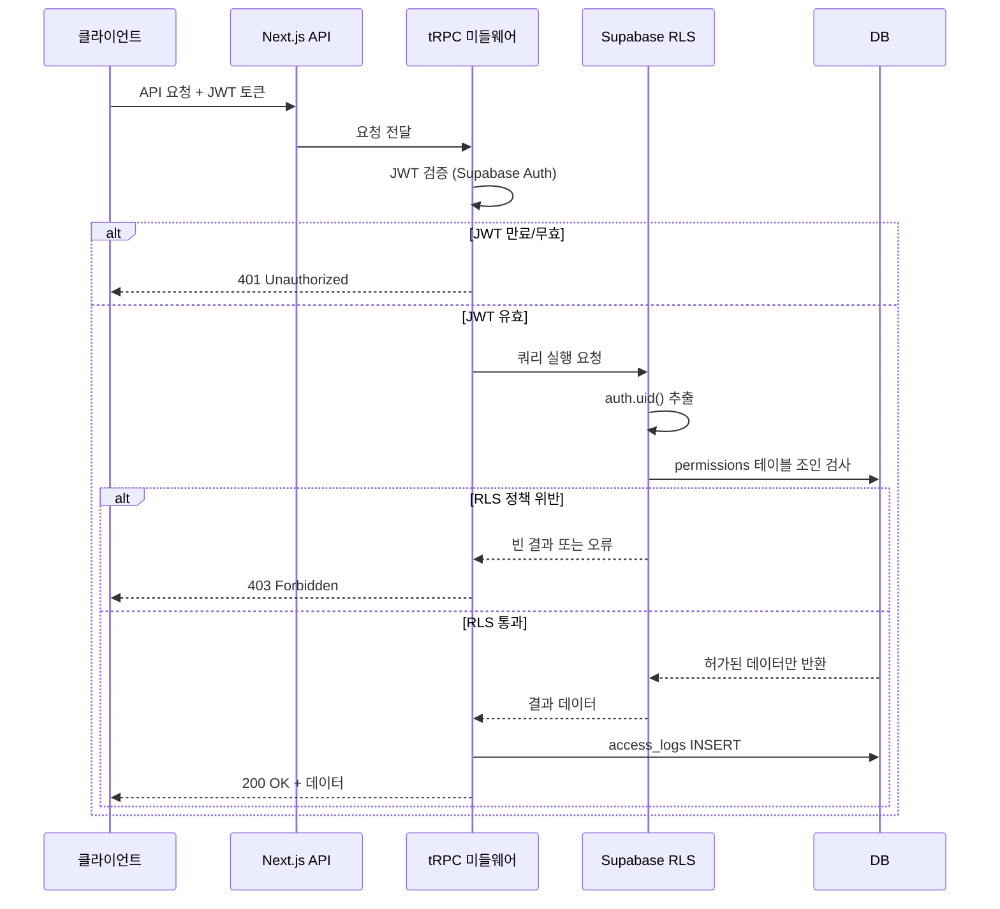

### 11-2. 파일 접근 보안 흐름

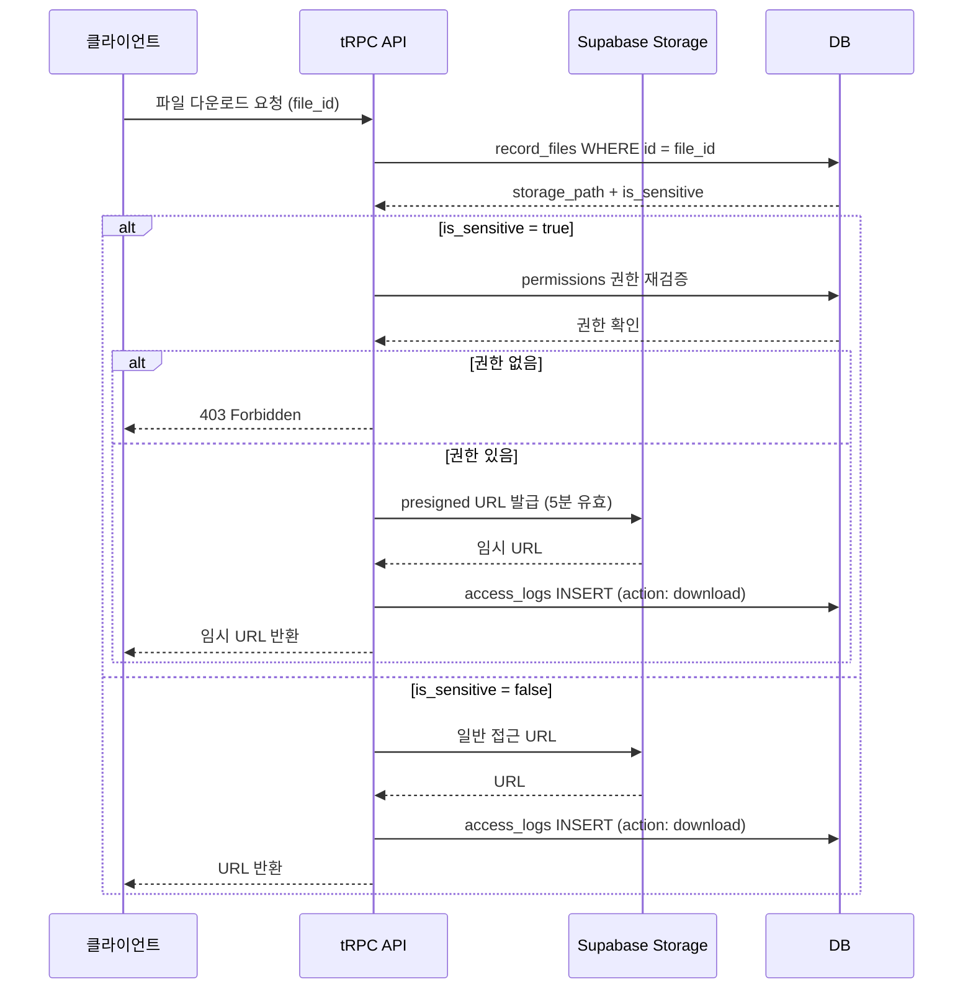

---

## 12. 전체 플랫폼 상태 흐름도

당사자 한 명을 중심으로 플랫폼의 전체 생애 흐름.

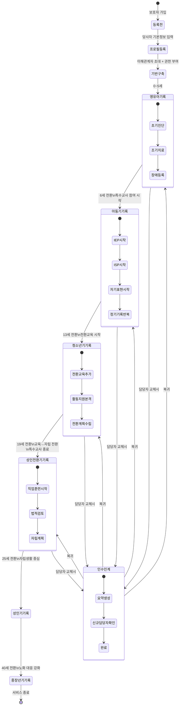

---

## 워크플로우 요약 매트릭스

| 워크플로우 | 주 사용자 | 빈도 | 핵심 DB 작업 |
|-----------|---------|------|------------|
| 온보딩 | 전체 | 최초 1회 | users, guardian_persons, person_accounts, **consents** INSERT (고유식별정보 입력 시 secure_identifiers) |
| 권한 부여 | 보호자 | 이해관계자 추가시 | permissions UPSERT, permission_logs INSERT |
| 권한 회수 | 보호자/시스템 | 필요시/만료시 | permissions UPDATE, permission_logs INSERT |
| 기록 작성 | 이해관계자 | 매일~월별 | records INSERT, access_logs INSERT |
| 자기표현 기록 | 당사자 | 매일 | self_expressions INSERT |
| 파일 첨부 | 보호자/이해관계자 | 필요시 | record_files INSERT, Storage 업로드 |
| 타임라인 조회 | 전체 | 수시 | records+self_expressions SELECT, access_logs INSERT |
| 인수인계 | 보호자/담당자 | 담당자 교체시 | handovers INSERT/UPDATE |
| 알림 | 시스템 자동 | 이벤트 발생시 | notifications INSERT, Realtime 발송 |
| 접근 로그 | 보호자 | 필요시 | access_logs SELECT |
| 전환기 처리 | 시스템/보호자 | 연 1회 이하 | persons UPDATE, life_milestones INSERT |
