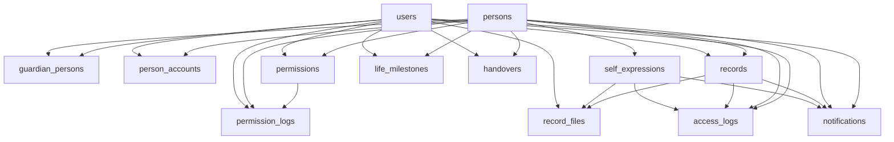

# DB 마이그레이션 순서 — OnDol 플랫폼

> 버전: v1.0 | 작성일: 2026-06-14

FK 의존성 기반 위상 정렬 생성 순서를 정의해 마이그레이션 시 참조 무결성 충돌(존재하지 않는 부모 테이블 참조)을 방지한다.

---

## 목차

1. [개요 및 원칙](#1-개요-및-원칙)
2. [FK 의존성 그래프](#2-fk-의존성-그래프)
3. [Step 0 — Enum 타입 정의](#3-step-0--enum-타입-정의)
4. [Step 1~5 — 테이블 생성 (위상 정렬)](#4-step-15--테이블-생성-위상-정렬)
5. [Step 6 — 인덱스 생성](#5-step-6--인덱스-생성)
6. [Step 7 — 트리거 / 함수](#6-step-7--트리거--함수)
7. [Step 8 — RLS 정책 활성화](#7-step-8--rls-정책-활성화)
8. [롤백 고려사항](#8-롤백-고려사항)
9. [마이그레이션 단계 요약](#9-마이그레이션-단계-요약)

---

## 1. 개요 및 원칙

- **대상 테이블:** 13개 (`persons`, `users`, `guardian_persons`, `person_accounts`, `permissions`, `permission_logs`, `records`, `self_expressions`, `record_files`, `access_logs`, `life_milestones`, `handovers`, `notifications`)
- **DB:** PostgreSQL (Supabase) | 기본 타임존 KST(UTC+9)
- **정렬 기준:** `docs/02-data-specification.md §2`에 명시된 **실제 FK만** 사용해 위상 정렬한다.
- **루트 테이블:** `users`, `persons` — 외부(`auth.users`) 외에 OnDol 내부 FK 의존이 없으므로 가장 먼저 생성한다.
- **불변(INSERT-only) 테이블:** `access_logs`, `permission_logs` — RLS에서 UPDATE/DELETE를 차단한다(롤백 시 주의, §8 참조).
- **참고 문서:** `docs/02-data-specification.md`(테이블·FK·Enum·인덱스·제약), `docs/03-erd.md`(관계), `docs/08-wbs.md`(트리거 작업 ID), `docs/13-rls-policy.md`(RLS 정책).

> `users.id`는 Supabase `auth.users.id`를 참조하는 외부 FK다. 본 순서표는 OnDol 애플리케이션 스키마 내부 의존성만 다루며, `auth` 스키마는 Supabase가 선행 provisioning 한 것으로 가정한다.

---

## 2. FK 의존성 그래프



> 화살표 `A --> B`는 "B가 A를 FK로 참조한다(A가 먼저 존재해야 한다)"를 의미한다.

---

## 3. Step 0 — Enum 타입 정의

테이블보다 먼저 생성한다. `docs/02-data-specification.md §4`의 5개 enum 전부. (테이블 컬럼은 TEXT로 정의되어 있으나, enum 타입을 우선 생성해 CHECK/도메인 검증·향후 타입 전환에 대비한다.)

```sql
-- 0.1 사용자 역할
CREATE TYPE user_role AS ENUM (
  'guardian', 'person', 'supporter', 'teacher', 'social_worker', 'therapist'
);

-- 0.2 분야
CREATE TYPE domain_type AS ENUM (
  'medical', 'education', 'welfare', 'daily', 'transition', 'legal', 'all'
);

-- 0.3 접근 수준
CREATE TYPE access_level AS ENUM (
  'read', 'write', 'edit', 'admin'
);

-- 0.4 생애주기 단계
CREATE TYPE life_stage AS ENUM (
  'infant', 'child', 'adolescent', 'young_adult', 'adult', 'senior'
);

-- 0.5 이정표 분류
CREATE TYPE milestone_category AS ENUM (
  'diagnosis', 'school_entry', 'graduation', 'service_start', 'service_end',
  'employment', 'independent', 'caregiver_change', 'medical_event',
  'legal_change', 'other'
);
```

| # | Enum | 사용 테이블/컬럼 |
|---|------|----------------|
| 0.1 | `user_role` | `users.role` |
| 0.2 | `domain_type` | `permissions.domain`, `permission_logs.domain`, `records.domain`, `handovers.domain` |
| 0.3 | `access_level` | `permissions.access_level` |
| 0.4 | `life_stage` | `persons.current_life_stage`, `records.life_stage`, `life_milestones.life_stage` |
| 0.5 | `milestone_category` | `life_milestones.category` |

---

## 4. Step 1~5 — 테이블 생성 (위상 정렬)

각 레벨 내 테이블끼리는 상호 FK 의존이 없어 순서 무관(동일 레벨 병렬 생성 가능). 레벨 간에는 반드시 낮은 번호부터 생성한다.

### Step 1 — 루트 테이블 (FK 없음)

| 테이블 | 의존(FK 대상) | 비고 |
|--------|--------------|------|
| `users` | (외부) `auth.users.id` | WBS 1.1.1. PK가 곧 `auth.users` FK. OnDol 내부 의존 없음 |
| `persons` | — | WBS 1.1.2. 모든 기록의 소유자. 내부 의존 없음 |

### Step 2 — 1차 연결 테이블 (users, persons만 참조)

| 테이블 | 의존(FK 대상) | 비고 |
|--------|--------------|------|
| `guardian_persons` | `users`(guardian_id), `persons`(person_id) | WBS 1.1.3. N:M. `UNIQUE(guardian_id, person_id)` |
| `person_accounts` | `persons`(person_id=PK), `users`(user_id, NULL 허용) | WBS 1.1.4. 1:1(선택). PK=person_id |
| `permissions` | `persons`(person_id), `users`(user_id), `users`(granted_by) | WBS 1.1.5. users ×2 참조. `UNIQUE(person_id, user_id, domain)` |
| `records` | `persons`(person_id), `users`(author_id) | WBS 1.1.7. content JSONB |
| `self_expressions` | `persons`(person_id) | WBS 1.1.8. `UNIQUE(person_id, expression_date)` |
| `life_milestones` | `persons`(person_id), `users`(created_by) | WBS 1.1.10 |
| `handovers` | `persons`(person_id), `users`(from_user_id), `users`(to_user_id) | WBS 1.1.11. users ×2 참조(둘 다 NULL 허용) |

> `permissions.granted_by`, `handovers.from_user_id`/`to_user_id`는 모두 `users`를 가리키는 추가 FK다. 부모가 이미 Step 1에서 생성되므로 Step 2에서 안전하다.

### Step 3 — records / self_expressions 의존 테이블

| 테이블 | 의존(FK 대상) | 비고 |
|--------|--------------|------|
| `permission_logs` | `permissions`(permission_id, 삭제 후 NULL 허용), `persons`(person_id), `users`(changed_by) | WBS 1.1.6. INSERT-only. `permissions` 선행 필요 → Step 3 |
| `record_files` | `records`(record_id, NULL 허용), `self_expressions`(self_expression_id, NULL 허용), `users`(uploader_id) | WBS 1.1.9. `CHECK (record_id XOR self_expression_id NOT NULL)` |

> `permission_logs.user_id`는 권한 대상자 ID를 직접 저장하는 컬럼으로, ERD §테이블 간 참조 정리에 따라 **형식 FK가 아니다**(제약 미설정). `permission_id`만 실제 FK다.

### Step 4 — 알림 (records/self_expressions 선택 참조)

| 테이블 | 의존(FK 대상) | 비고 |
|--------|--------------|------|
| `notifications` | `users`(recipient_id), `persons`(person_id), `records`(record_id, NULL 허용), `self_expressions`(self_expression_id, NULL 허용) | WBS 1.1.13. `record_id` XOR `self_expression_id`(둘 중 최대 하나만 NOT NULL) |

### Step 5 — 접근 로그 (불변, 최대 참조)

| 테이블 | 의존(FK 대상) | 비고 |
|--------|--------------|------|
| `access_logs` | `users`(user_id), `persons`(person_id), `records`(record_id, NULL 허용), `self_expressions`(self_expression_id, NULL 허용) | WBS 1.1.12. INSERT-only(불변). 4개 부모 모두 선행 필요 → 마지막 |

> `notifications`와 `access_logs`는 의존 집합이 사실상 동일(`users`·`persons`·`records`·`self_expressions`)하다. 둘 다 Step 3 완료 후 생성 가능하므로 Step 4/5는 상호 순서 무관이며, 본 표에서는 가독성을 위해 분리했다.

---

## 5. Step 6 — 인덱스 생성

대상 테이블 생성 완료 후 `docs/02-data-specification.md §5`의 인덱스를 생성한다. (UNIQUE 제약 인덱스는 테이블 DDL에 포함되었다고 가정하고, 아래는 조회 성능용 보조 인덱스다.)

```sql
-- records
CREATE INDEX idx_records_person_domain ON records(person_id, domain);
CREATE INDEX idx_records_person_date   ON records(person_id, record_date DESC);
CREATE INDEX idx_records_author        ON records(author_id);
CREATE INDEX idx_records_life_stage    ON records(person_id, life_stage);
CREATE INDEX idx_records_milestone     ON records(person_id) WHERE is_milestone = true;

-- permissions
CREATE INDEX idx_permissions_person_user ON permissions(person_id, user_id);
CREATE INDEX idx_permissions_user_active ON permissions(user_id, is_active) WHERE is_active = true;
CREATE UNIQUE INDEX idx_permissions_unique ON permissions(person_id, user_id, domain);

-- self_expressions
CREATE INDEX idx_self_expr_person_date ON self_expressions(person_id, expression_date DESC);

-- access_logs
CREATE INDEX idx_access_logs_person ON access_logs(person_id, created_at DESC);
CREATE INDEX idx_access_logs_user   ON access_logs(user_id, created_at DESC);

-- notifications
CREATE INDEX idx_notifications_recipient ON notifications(recipient_id, is_read, created_at DESC);
```

> `idx_permissions_unique`는 §6 제약 `UNIQUE(person_id, user_id, domain)`과 동일하다. 테이블 DDL에서 제약으로 선언했다면 중복 생성하지 않는다.

---

## 6. Step 7 — 트리거 / 함수

대상 테이블·인덱스 생성 후 등록한다. WBS에 정의된 DB 트리거/함수만 포함한다.

| # | 트리거/함수 | 대상 테이블 | WBS ID | 설명 |
|---|------------|-----------|--------|------|
| 7.1 | 생애주기 자동 계산 | `persons` | 3.2.9 | `birth_date` 기준 `current_life_stage`(영유아~노년 6단계) 자동 산정 (INSERT/UPDATE) |
| 7.2 | 권한 변경 이력 기록 | `permissions` → `permission_logs` | 4.3.1 | `permissions` 변경(granted/revoked/modified) 시 `permission_logs` 자동 INSERT |
| 7.3 | 생애주기 자동 마커 | `persons` → `life_milestones` | 8.2.8 | 생애주기 단계 전환 시 타임라인 마커(이정표) 자동 삽입 |
| 7.4 | read 자동 로깅 | (조회) → `access_logs` | 11.1 | 모든 read 접근을 `access_logs`에 자동 기록 |
| 7.5 | write 자동 로깅 | (기록) → `access_logs` | 11.2 | 모든 write 동작을 `access_logs`에 자동 기록 |
| 7.6 | 권한 외 접근 시도 로깅 | (RLS 위반) → `access_logs` | 4.4.1 / 11.3 | RLS 위반·권한 외 리소스 접근 시도 별도 로깅 |
| 7.7 | 알림 자동 생성 | 이벤트 → `notifications` | 10.1.1 | 기록 작성·권한 변경·인계 등 이벤트별 알림 자동 INSERT |

> 7.2·7.3·7.7은 대상 테이블(`permission_logs`, `life_milestones`, `notifications`)이 모두 생성된 **이후**여야 한다(Step 3/4 완료 후). 7.4~7.6은 `access_logs`(Step 5) 생성 후 등록한다.

---

## 7. Step 8 — RLS 정책 활성화

모든 테이블·트리거 등록 후 RLS를 활성화한다. 상세 정책 정의는 `docs/13-rls-policy.md`, 요약은 `docs/03-erd.md §RLS 정책 요약`을 따른다.

| # | 정책 | 대상 테이블 | WBS ID | 핵심 조건 |
|---|------|-----------|--------|----------|
| 8.1 | records SELECT | `records` | 1.2.1 | 보호자(매핑)·당사자 본인·권한자(`permissions` 유효기간 내 read 이상)만 조회 |
| 8.2 | records INSERT/UPDATE | `records` | 1.2.2 | 도메인 + `access_level`(write 이상) 검증 |
| 8.3 | self_expressions 작성 | `self_expressions` | 1.2.3 | 당사자 본인 계정(`person_accounts`)만 작성/수정(당일) |
| 8.4 | access_logs INSERT-only | `access_logs` | 1.2.4 | INSERT만 허용, UPDATE/DELETE 정책 없음 → 자동 거부(불변성) |
| 8.5 | permissions 변경 | `permissions` | 1.2.5 | 주보호자만 권한 부여/수정/회수 |

> `permission_logs` 역시 INSERT-only로 운영하므로(§02 §6), UPDATE/DELETE 정책을 만들지 않아 불변성을 보장한다.

---

## 8. 롤백 고려사항

### 8.1 FK 역순 삭제

다운(롤백) 마이그레이션은 생성의 **정확한 역순**으로 진행한다. 자식 테이블이 부모를 참조하므로, 부모를 먼저 지우면 의존성 오류가 발생한다.

```
삭제 순서 (생성 역순):
  Step 8: RLS 정책 DROP
  Step 7: 트리거/함수 DROP
  Step 6: 인덱스 DROP
  Step 5: access_logs
  Step 4: notifications
  Step 3: record_files → permission_logs
  Step 2: handovers → life_milestones → self_expressions → records
          → permissions → person_accounts → guardian_persons
  Step 1: persons → users
  Step 0: Enum 타입 DROP (user_role, domain_type, access_level,
          life_stage, milestone_category)
```

- 동일 레벨 내 테이블끼리는 상호 FK가 없으므로 레벨 내 삭제 순서는 무관하다.
- 트리거(Step 7)와 RLS(Step 8)는 테이블 DROP 전에 제거해야 잔존 의존 오류를 피한다. `DROP TABLE ... CASCADE`를 쓰면 종속 객체가 함께 제거되나, 의도치 않은 객체 삭제를 막기 위해 명시적 역순 DROP을 권장한다.
- `record_files`·`notifications`·`access_logs`는 `records`/`self_expressions`를 참조하므로 반드시 이들보다 먼저 삭제한다.

### 8.2 INSERT-only(불변) 테이블 주의

- **`access_logs`, `permission_logs`** 는 RLS상 UPDATE/DELETE가 차단된다(감사 불변성). 롤백으로 데이터를 비우려면 RLS 정책을 먼저 비활성화하거나 superuser/owner 권한으로 `TRUNCATE`/`DROP`해야 한다.
- 운영 환경에서는 이 두 테이블의 데이터 삭제 자체가 감사 정책 위반일 수 있다. **데이터 롤백이 아닌 스키마 롤백** 시에도 보존 정책을 확인한다.
- `permission_logs.permission_id`는 부모 권한 삭제 시 NULL로 남는다(삭제 후 NULL 허용). 따라서 `permissions` 롤백이 `permission_logs` 행을 직접 삭제하지는 않는다.

### 8.3 부분 실패 대비

- 각 Step을 단일 트랜잭션으로 감싸 부분 적용을 방지한다. 단, `CREATE INDEX CONCURRENTLY`(무중단 인덱싱)는 트랜잭션 밖에서 실행해야 하므로 Step 6은 운영 데이터 존재 시 별도 처리한다.
- Supabase 마이그레이션 파일은 `0000_enums` → `0001_root` → ... → `0008_rls` 형태로 Step 단위 파일을 분리해 버전 추적성을 확보한다.

---

## 9. 마이그레이션 단계 요약

| Step | 단계명 | 객체 수 | WBS 매핑 |
|:----:|--------|:------:|---------|
| 0 | Enum 타입 정의 | 5 enum | 02 §4 |
| 1 | 루트 테이블 | 2 테이블 (`users`, `persons`) | 1.1.1~1.1.2 |
| 2 | 1차 연결/기록 테이블 | 7 테이블 | 1.1.3~1.1.5, 1.1.7~1.1.8, 1.1.10~1.1.11 |
| 3 | 로그/파일 테이블 | 2 테이블 (`permission_logs`, `record_files`) | 1.1.6, 1.1.9 |
| 4 | 알림 테이블 | 1 테이블 (`notifications`) | 1.1.13 |
| 5 | 접근 로그(불변) | 1 테이블 (`access_logs`) | 1.1.12 |
| 6 | 인덱스 | 12 인덱스 | 02 §5 |
| 7 | 트리거/함수 | 7 트리거 | 3.2.9, 4.3.1, 8.2.8, 11.1~11.3, 4.4.1, 10.1.1 |
| 8 | RLS 정책 활성화 | 5 정책군 | 1.2.1~1.2.5 |

- **총 마이그레이션 단계: 9단계 (Step 0~8)**
- **테이블: 13개** (Step 1~5 합계: 2 + 7 + 2 + 1 + 1)
- **위상 정렬 레벨: 5단계** (루트 → 1차 연결 → 로그/파일 → 알림 → 접근로그)

---

> 본 문서는 `docs/02-data-specification.md §2`의 실제 FK 정의만을 근거로 작성되었으며, 발명된 테이블·FK는 없다. RLS 상세는 `docs/13-rls-policy.md`를 참조한다.
